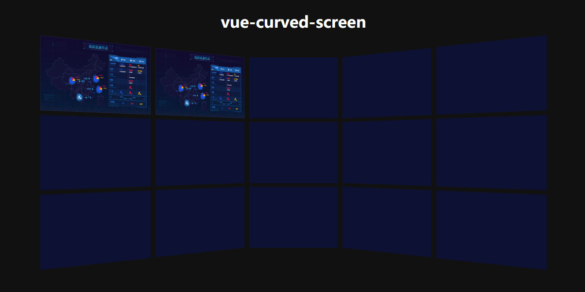

# vue-curved-screen

> A curved screen display component based on Vue.js.

## Preview
 



## How to use

```
npm install vue-curved-screen -S
```

```
<template>
  <curved-screen>
      <template #screen11>
        
      </template>
      <template #screen12>
        
      </template>
  </curved-screen>
</template>

<script>
import CurvedScreen from 'vue-curved-screen'

export default {
  name: 'App',
  components: {
    CurvedScreen
  }
}
</script>

```

## Events

|Event Name|Description|Parameters|
| -- | -- | -- |
|screen-click|triggers when clicking a screen|{ columnItem, rowItem, event }|
|screen-mouse-enter|triggers when hovering into a screen|{ columnItem, rowItem, event }|
|screen-mouse-leave|triggers when hovering out of a screen|{ columnItem, rowItem, event }|

## Todo

- [ ] Custome ratation angle.
- [ ] Custome number of screens.
- [ ] Add animation.
